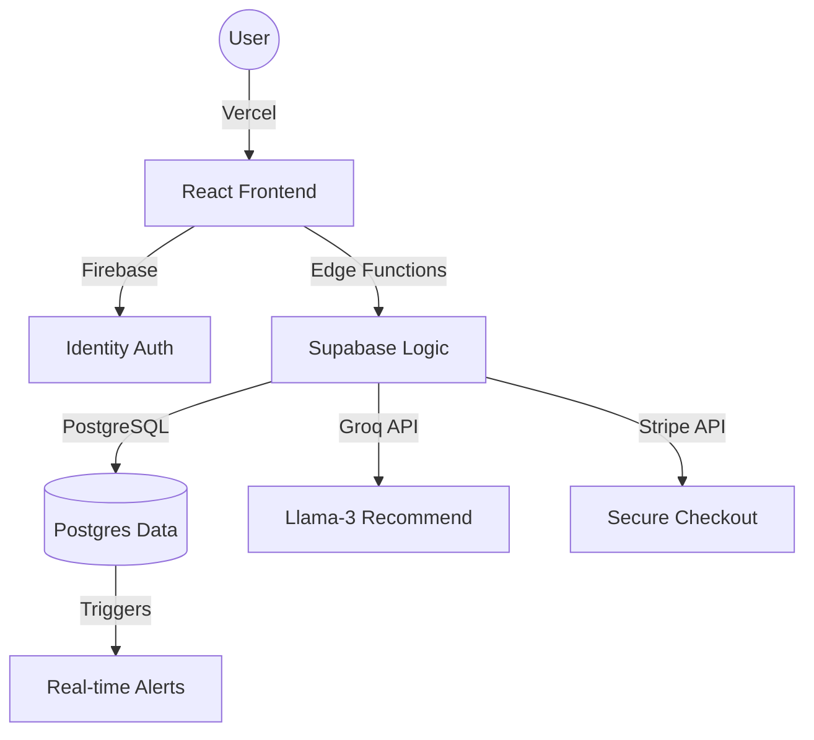

# 🧵 Suraj Sewing Machine v1.1.2 (Enterprise Edition)
[](https://suraj-sewing-v2.vercel.app)
[](https://suraj-sewing-v2.vercel.app)

A high-performance, professional e-commerce platform for industrial and domestic sewing machines. Re-engineered in **v1.1.2** for maximum scalability, security, and a premium "motion-first" user experience.

---

## ⚡️ Modern Architecture
The platform has been migrated from a traditional monolith to a **globally distributed serverless architecture**.

- **Frontend**: React 19 + Vite (Deployed on Vercel)
- **Backend (Logic)**: Supabase Edge Functions (Deno / TypeScript)
- **Database**: PostgreSQL with Row-Level Security (Supabase)
- **Authentication**: Firebase Auth (Sync'd with internal Postgres)
- **AI Engine**: Groq SDK (Llama 3-8b inference)
- **Payments**: Stripe Cloud Integration
- **Media**: Cloudinary CDN

---

## ✨ Premium Features

### 💎 Professional UI & UX
- **Motion-First Navigation**: Smooth, elastic transitions built with `Framer Motion`.
- **Glassmorphism Design**: High-end frosted glass layout with responsive shadows.
- **Micro-interactions**: Intuitive feedback loops for cart additions, wishlist, and profile actions.
- **Full Responsiveness**: Optimized for everything from ultra-wide monitors to the smallest mobile devices.

### 🤖 Intelligence & Automation
- **AI Personal Shopper**: Real-time sewing machine recommendations powered by Groq’s ultra-fast Llama3 inference.
- **Repair Service Engine**: Custom token-based repair request system with real-time status tracking.
- **Auto-Notifications**: Trigger-based notification system for order updates and service alerts.

### 💳 Enterprise-Grade Security
- **Serverless Payments**: Secure Stripe flow with no local data persistence.
- **RLS (Row Level Security)**: Advanced PostgreSQL policies ensuring users can only access their own data.
- **Firebase Auth**: Secure, identity-first authentication with Google & Email providers.

---

## 🛠 Tech Stack Deep-Dive

| Layer | Technology | Purpose |
| :--- | :--- | :--- |
| **Frontend** | React 19, Tailwind CSS v4 | Ultra-fast, component-based UI |
| **Animation** | Framer Motion | Fluid, 60fps transitions |
| **Compute** | Supabase Edge Functions | Serverless logic at the network edge |
| **Storage** | PostgreSQL | Relational data with real-time capabilities |
| **AI** | Groq (Llama-3) | Lightning-fast LLM inference |
| **Gateway** | Stripe | Global standard for secure payments |
| **Deployment** | Vercel | Automatic CI/CD & Global CDN |

---

## 📈 System Workflow (Mermaid)



---

## 🚀 Deployment & Local Setup

### Live Production
The site is automatically deployed to: [https://suraj-sewing-v2.vercel.app](https://suraj-sewing-v2.vercel.app)

### Local Development
1. **Clone the Project**:
   ```bash
   git clone [your-repo-url]
   ```
2. **Install Dependencies**:
   ```bash
   cd Suraj_Sewing_Machien/frontend && npm install
   ```
3. **Set up .env**:
   Create a `.env` in `frontend/` with:
   - `VITE_SUPABASE_URL`
   - `VITE_SUPABASE_ANON_KEY`
   - `VITE_FIREBASE_API_KEY`
   - `VITE_STRIPE_PUBLISHABLE_KEY`
4. **Run Dev Server**:
   ```bash
   npm run dev
   ```

---

## 📜 Version History
- **v1.1.2 (Current)**: Full serverless migration, Framer Motion UI, Groq AI.
- **v1.1.0**: Supabase integration, Repair Token system.
- **v1.0.0**: Initial MERN-stack MVP.

---

**Built with ❤️ for the sewing industry.**
